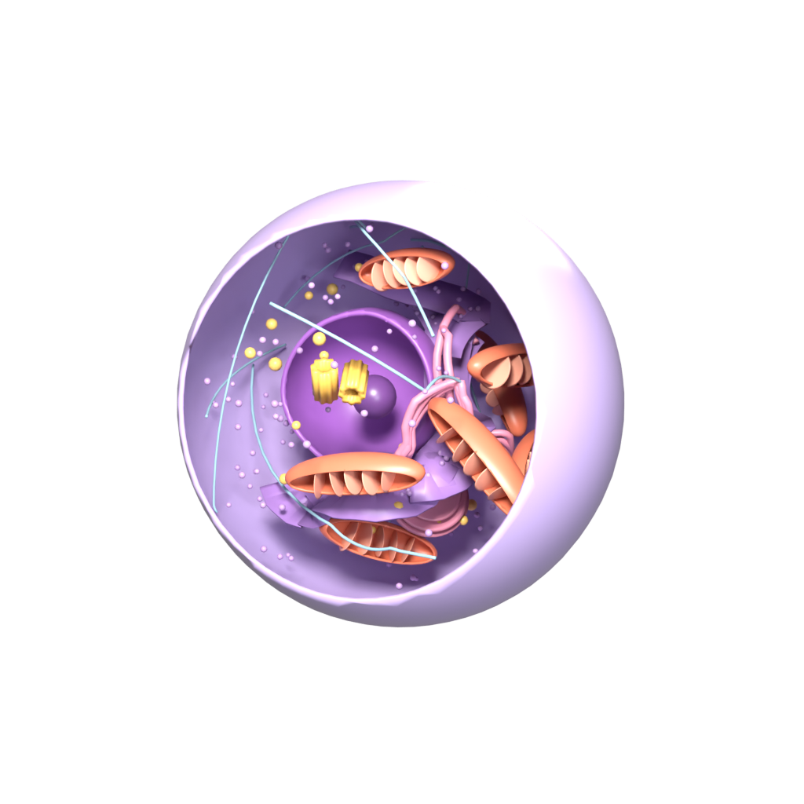
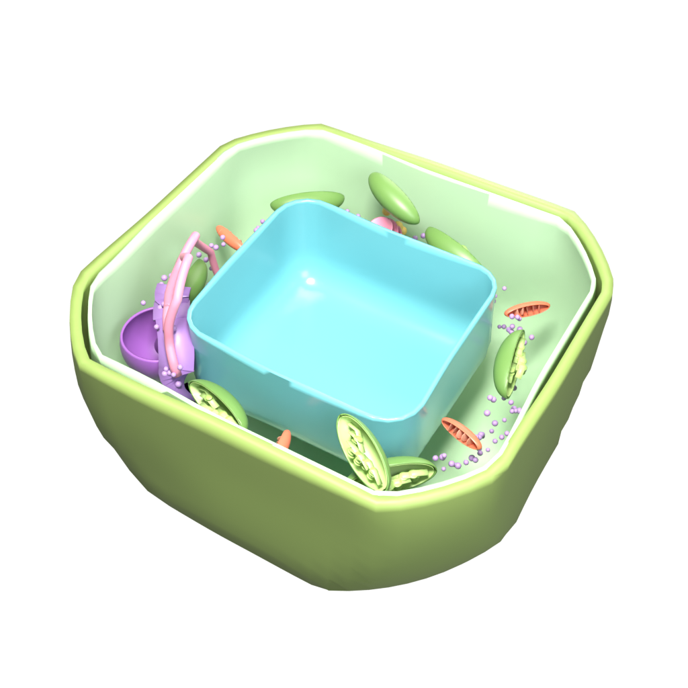
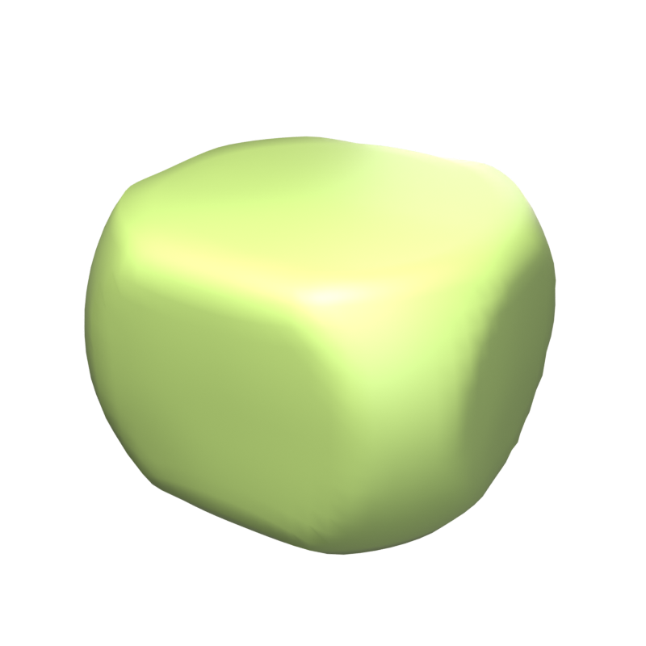
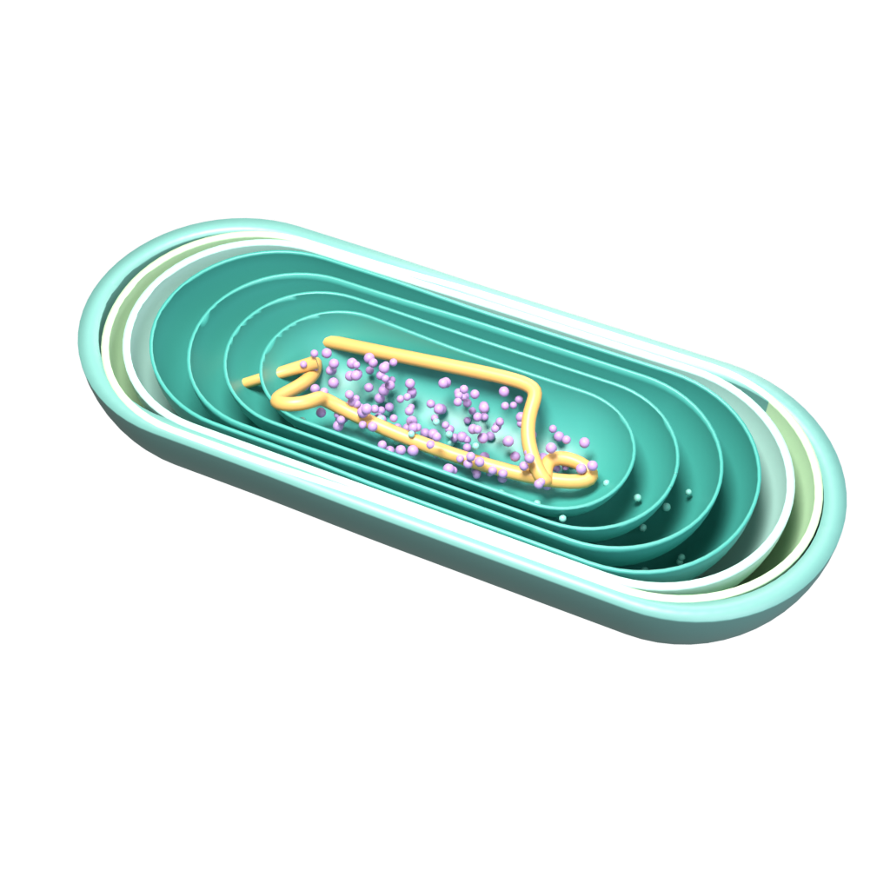
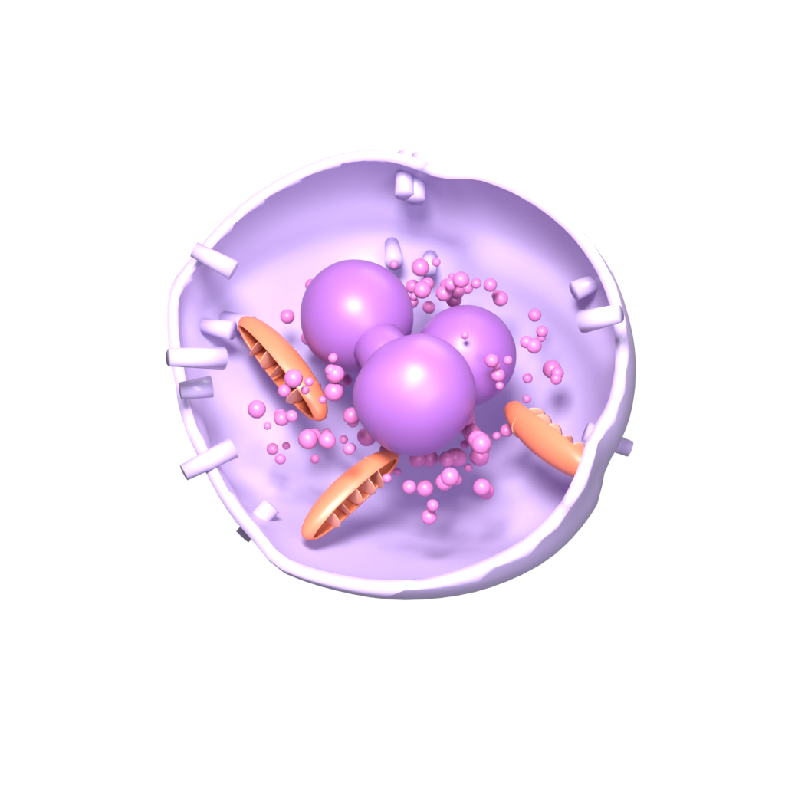
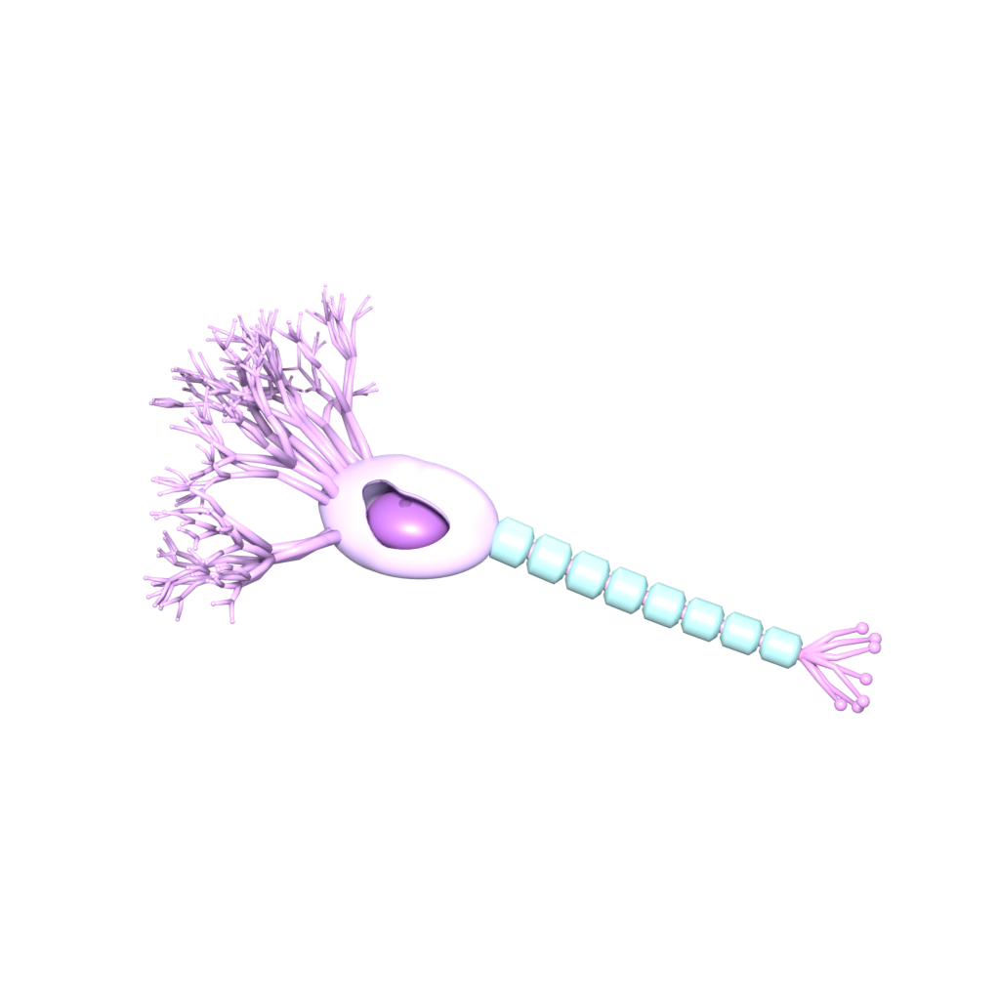
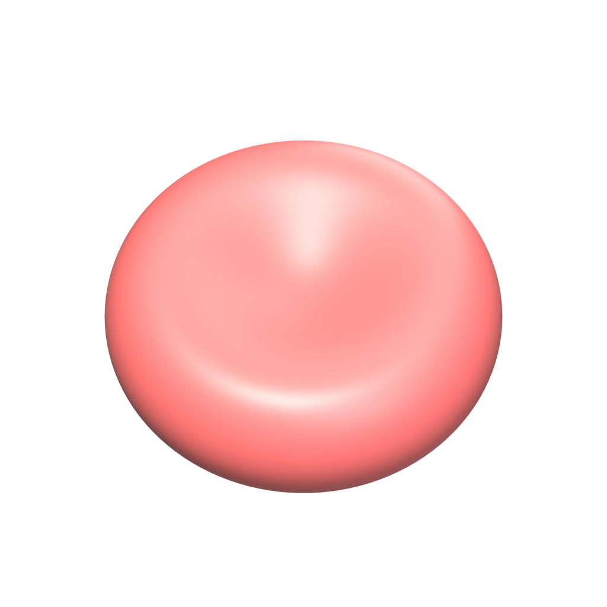
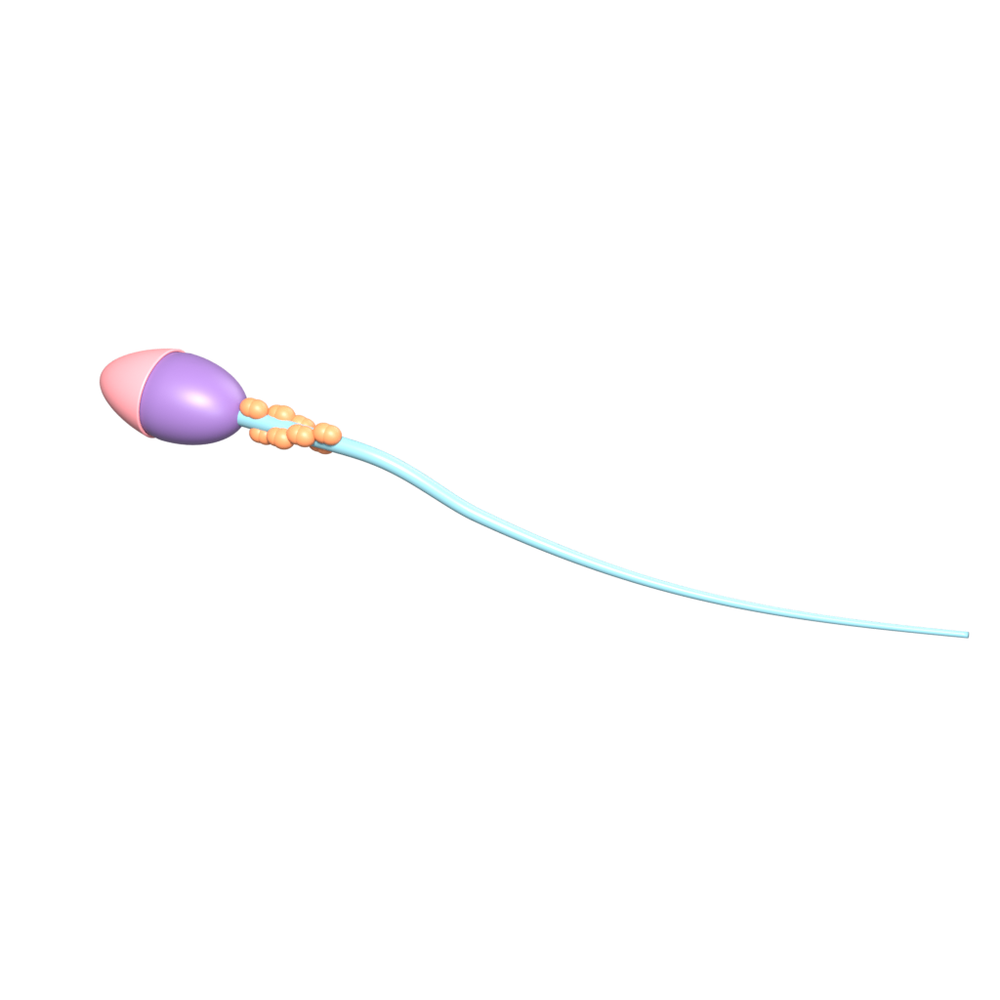

# Cell Atelier · 细胞标本室（复刻版）

**面向高中生物学习的交互式 3D 细胞标本。** 使用 Blender 程序化构建模型，通过 Three.js 在浏览器中旋转、缩放和点选结构，把细胞形态与中文结构笔记放在同一张学习界面中。

当前收录 **7 类标本**（动物细胞、植物叶肉细胞、蓝细菌、中性粒细胞、有髓神经元、成熟红细胞、人类精子）· 中文结构笔记 · 植物细胞三种视图 · 可分享链接 · GLB 下载 · MIT 开源

> 本项目是对开源项目 [Irissunsun/cell-atelier](https://github.com/Irissunsun/cell-atelier) 的**复刻实现**：产品形态与教学思路参考原作，建模脚本、几何生成、前端代码与教学文字均为独立编写。原作使用 Blender 5.2.1 + Three.js，本复刻沿用同一管线（程序化建模 → GLB → Three.js），详见[许可与致谢](#许可与致谢)。



[效果图册](#效果图册) · [植物细胞观察模式](#植物细胞观察模式) · [快速开始](#快速开始) · [操作指南](#操作指南) · [模型重建](#模型重建) · [常见问题](#常见问题)

## 能做什么

| 功能 | 使用方式 |
| --- | --- |
| 浏览七类标本 | 点击左侧带模型缩略图的标本名称，切换 3D 模型与结构列表 |
| 点选结构 | 点击结构名称或模型表面；查看轮廓高亮、引线、中文名称与功能笔记 |
| 观察空间关系 | 拖动旋转、滚轮缩放；使用自动旋转从多个角度观察 |
| 排除遮挡 | 隐藏细胞膜（植物细胞连同细胞壁），或将选中结构单独显示 |
| 植物细胞三种视图 | 在整体、剖面与透明外壳之间切换；开启可点击结构标签 |
| 比较细胞 | 使用页面下方的动物细胞、植物叶肉细胞与蓝细菌结构对照表 |
| 并排对比 | 两个标本放进同一视口、按同一真实比例绘制，点一个结构名两边同时高亮 |
| 真实尺度 | 视口左下角有按比例换算的标尺，拖动缩放时读数自动换挡，下方还有一张同尺度对比图 |
| 结构辨认练习 | 出题点出指定结构，答错会说出你点到了什么，末尾给出成绩 |
| 轻量交付 | 构建时把 17.6 MB 模型压到 3.3 MB，断网教室也能快速打开 |
| 离线可用 | 首次访问后整个标本室被缓存，之后无网也能打开、切换标本与进入对比；可安装为桌面应用 |
| 发布与分享 | 推送即发布到 GitHub Pages；六条"直接停在某个画面"的深链接配二维码；另有 2.5 MB 离线包供无网教室 |
| 可回归 | 模型穿插有基线记录，发布前一条命令确认没有引入新的穿模 |
| 分享观察位置 | 地址栏同步标本、结构与视图状态，可直接把链接发给学生 |
| 导出与复用 | 下载当前标本的 GLB；保存 WebGL 模型截图 |

可用于课堂投屏、课前预习与结构辨认练习。教师可以先让学生观察整体，再依次定位结构并讨论形态与功能。模型属于教学简化示意，使用范围见[教学范围](#教学范围)。

## 效果图册

以下图片直接使用 `public/` 中的当前 GLB 渲染，背景透明，展示模型本身；网页中的结构选择、标签与笔记需要本地运行后体验。

### 动物细胞 · Animal Cell


典型有核动物细胞剖面，九类可选结构：细胞核（含核仁）、线粒体、内质网、高尔基体、细胞膜、细胞骨架、中心粒、囊泡与核糖体。模型表现线粒体内部折叠的嵴、围绕核膜的粗面内质网片层与光面内质网管道，以及一对近似垂直的中心粒。

### 植物叶肉细胞 · Plant Cell



以成熟叶肉细胞为参考。中央液泡占据较大空间，细胞核与其他细胞器分布在周围细胞质中。九类可选结构：细胞核、叶绿体、中央液泡、细胞壁、细胞膜、线粒体、内质网、高尔基体与核糖体。叶绿体剖面包含被膜、基粒堆叠与基质片层。

模型的取舍写在明处：真实的叶肉细胞长 30–100 µm，液泡几乎占满整个细胞，留给其余细胞器的只是贴着细胞壁的薄薄一层。照此比例建模时，即使把叶绿体缩到真实尺寸，它们仍会彼此挤在一起并压进液泡。因此这里把整个细胞包络放大了 15%（**比例不变**，液泡依旧是剖面的主体），叶绿体则按真实尺寸的约两倍绘制——太小就看不清基粒。叶绿体数量简化为 6 个（真实细胞有 30–50 个），液泡、细胞核与叶绿体的位置都经过相交检查。

### 植物细胞闭合外壳 · Closed envelope



`public/plant-shells.glb` 是与剖面模型同尺寸的闭合细胞壁与细胞膜，供网页“整体 / 透明”两种观察方式使用。

### 蓝细菌 · Cyanobacterium



具类囊体的单细胞蓝细菌示意，营养细胞呈杆状。六类可选结构：拟核、核糖体、类囊体、细胞膜、细胞壁与外膜、细胞质。拟核 DNA 没有核膜包围；光合膜直接位于细胞内部，不属于叶绿体——这正是这个标本要说明的两件事。

### 中性粒细胞 · White Blood Cell



白细胞标本选用中性粒细胞。可选结构为分叶细胞核、胞质颗粒、线粒体与细胞膜。细胞轮廓与表面突起按变形虫状运动细胞概括；不同类型的白细胞形态差异很大，本模型不代表所有白细胞。

### 有髓神经元 · Neuron



七类可选结构：胞体、细胞核、树突、轴突、髓鞘、轴突末梢与胞体膜。胞体与细胞核采用剖切；轴突外的髓鞘分节包裹，节间空隙对应郎飞结所在区域。形成髓鞘的胶质细胞未绘出。

### 成熟红细胞 · Red Blood Cell



双凹圆盘，中央薄、周缘厚，两面凹陷但不穿孔。提供细胞膜与含血红蛋白的细胞质两个选择入口；选择细胞质会自动隐藏外膜。人类成熟红细胞没有细胞核、线粒体和核糖体——这不是模型遗漏，而是这个标本的教学重点。

### 人类精子 · Sperm Cell



包含顶体、细胞核、线粒体鞘和渐细鞭毛四类可选结构。头部表现顶体帽与浓缩的细胞核；中段用螺旋排列的线粒体鞘示意供能结构；长尾表现运动结构的整体形态。整个标本没有剖切，所有结构都是闭合表面。

## 观察方式

每个标本都有自己的观察方式，面板由 `specimens.js` 中的 `views` 声明，而不是写死在页面里。两类：

**几何模式**（适用于有剖切的标本）——剖面显示模型自带的剖切外壳，整体与透明则淡入同尺寸的闭合外壳 `<id>-shells.glb`：

| 模式 | 观察重点 | 当前行为 |
| --- | --- | --- |
| 剖面 | 内部结构与相对位置 | 显示剖切外壳，内部细胞器可见 |
| 整体 | 完整外形与外侧边界 | 显示闭合外壳；开启标签时只标出外壳结构 |
| 透明 | 通过外壳定位内部结构 | 仅淡化闭合外壳，内部模型保留；标签可点击选择结构 |

动物细胞、植物细胞、蓝细菌、中性粒细胞、神经元支持这三种模式。植物细胞把「整体」放在第一位（与原项目一致），其余标本默认进入剖面。

**机位预设**（适用于没有剖切的标本）——红细胞与精子是闭合表面，切开并不成立，但形状本身需要特定角度才看得清：

| 标本 | 观察方式 |
| --- | --- |
| 成熟红细胞 | 正面（俯视圆盘与中央凹陷）、侧面（双凹轮廓） |
| 精子 | 整体（全长概览）、头部（顶体帽与细胞核）、中段（线粒体鞘螺旋） |

在整体模式点击左侧内部结构名称会自动进入剖面；重置会清除结构选择、恢复默认观察方式并关闭全部标签。所有标本都可以开启「结构标签」，得到一张可点击的标注图。

闭合外壳由 `build_envelopes.py` 生成：它复用各标本 `build_*.py` 中**同一组尺寸、同一次噪声位移与同一套材质**，只去掉剖切，因此切换模式时表面不会跳动；测试中有一项专门比对两者的底面轮廓。

## 真实尺度

屏幕上最容易误导人的一点是大小：细胞在这个页面里占满视野，实际上却小到肉眼看不见。视口左下角的标尺把这件事说清楚。

每个标本在 `specimens.js` 里声明「哪个结构、代表多少微米」（`size`），页面再用该结构在模型里的世界尺寸换算出 µm/单位，并在相机移动时重新投影：标尺宽度保持在 56–230 像素之间，读数在 0.2 / 0.5 / 1 / 2 / 5 / 10 / 20 / 50 / 100 µm 之间自动换挡。

| 标本 | 比例依据 | 真实尺寸 |
| --- | --- | --- |
| 动物细胞 | 细胞直径 | 20 µm |
| 植物叶肉细胞 | 细胞长度 | 50 µm || 蓝细菌 | 细胞长度 | 3 µm |
| 中性粒细胞 | 细胞直径 | 12 µm |
| 有髓神经元 | 胞体直径 | 20 µm（突起为示意长度） |
| 成熟红细胞 | 细胞直径 | 7.5 µm |
| 人类精子 | 头部长度 | 4.5 µm（尾部为示意长度） |

神经元与精子的模型并非处处等比例——真实轴突可长达一米，真实鞭毛约是头部的十倍——标尺下方会直接标出这一点，避免学生拿标尺去量这些结构。

页面下方还有一张**同尺度对比图**（`size-chart.js`）：七类标本按同一比例画在一起，从 50 µm 的叶肉细胞到 3 µm 的蓝细菌，宽度直接取自 `specimens.js` 里声明的尺寸，因此图与数据不会各说各话。单看一个标本永远看不出"它比另一个大多少"，这张图专门回答这个问题。

## 结构辨认练习

工具栏的「辨认练习」把标本变成一次随堂小测：页面报出一个结构名称，学生在模型上把它点出来。

- **答错会立刻说明你点到了什么**（"这是细胞核，再找找高尔基体"），而不是只说"错了"——错误本身就是一次辨认训练。
- **提示**会淡化其它结构、只保留目标原色；题目不作废，但这一题会计入"借助提示"。
- 左侧结构名称在练习中会淡化，但仍可点击（键盘用户需要它）。点名称算"借助名称"，与独立答对分开统计——名称就写在旁边，那是**认字**而不是**辨认**。
- 一次练习覆盖当前标本的全部可选结构，顺序随机；每题答对后先显示该结构的笔记，再进入下一题。
- 结束时会给出「独立答对 / 借助提示或名称 / 跳过」三项计数，并列出答错过的结构，可一键再来一轮。

练习期间切换标本、点重置或按 `Esc` 都会退出练习，不会留下半截状态。

## 资产体积

`public/` 里是 Blender 直接导出的原始资产，共 17.6 MB：float32 的位置、法线与 UV，没有任何压缩。下载一个 4 MB 的标本在教室里并不愉快，所以**构建时会把它们全部压到 3.3 MB（-81%）**：

```
npm run build      # 构建后自动压缩 dist/ 里所有 GLB
npm run compress   # 只做压缩并列出每个文件的收益，输出到 .compress-preview/
```

压缩用 `tools/compress-glb.mjs`：先焊接重复顶点、剪掉未引用的数据，再把位置量化到 14 位、法线 8 位、UV 12 位，最后用 `EXT_meshopt_compression` 做熵编码。14 位的位置精度在任何合理视距下都不到一个像素。

为什么不是把所有 GLB 直接压掉：`tools/check_intersections.py` 要读真实顶点，`tests/` 也要直接解析几何，而 meshopt 的缓冲区必须先解码。因此**开发与检查始终面对 `public/` 的原始文件，只有 `dist/` 是压缩版**——这个分工由 `tools/vite-plugin-compress-glb.js` 在构建末尾完成，`src.js` 注册一次 `MeshoptDecoder`，同一套加载器两种文件都能读。

## 并排对比

工具栏的「⇄ 对比」把当前标本与另一个标本放进同一个视口，**按同一个真实比例绘制**——20 µm 的动物细胞会明显小于 50 µm 的叶肉细胞，而不是各自占满画面。比例不是估的：两个模型各自在 `specimens.js` 里声明了真实尺寸，缩放系数由这两份声明算出来（植物细胞 1.0×、动物细胞 0.386×），视口左下角的标尺给出的就是这把共同的尺子。面板里同时写明"两标本按同一比例绘制"与两边各自的声明尺寸。

真正让并排有意义的是结构列表：对比时它变成两个标本的**并集**，点一次「线粒体」，两个细胞里属于线粒体的网格同时高亮、其余结构同时变灰——同一个结构在两种细胞里长什么样、在什么位置，一眼可见。只有一个标本才有的结构会标出来（例如「细胞骨架 / 只在动物细胞」），这本身就是教学内容。

对比时：辨认练习自动禁用（两个细胞会让题目有歧义）、观察方式按模式对两边同时生效（剖面/整体/透明各自取对应视图）、单独查看会同时只留下两边的目标结构。`?cell=animal-cell&compare=plant-cell` 可以直接分享这个状态。

## 离线使用

构建时会生成一个 Service Worker（`dist/sw.js`），它把**整个站点**——应用外壳、七类标本、外壳层、缩略图，压缩后共约 4.4 MB——在首次访问时一次性预缓存。此后再打开：没有网络也能用，标本能切换、能进对比模式、能开辨认练习。视口右上角有一枚徽标说明当前状态（`正在缓存… / 离线可用 / 离线缓存 12/29`）。

```
npm run build && npm run preview   # 生产包；离线只在构建产物里启用，开发服务器不带缓存
```

两个前提值得说明：

- **首次访问需要联网**（哪怕只有一次）。之后浏览器会一直用本地缓存，直到缓存被清除。
- **Service Worker 只在安全上下文注册**：`https://`、`http://localhost` 可以，`file://` 和 `http://<局域网 IP>` 不行。所以把 `dist/` 放到局域网 HTTP 服务器上时页面能正常用，但**不会有离线能力**；要离线就得走 HTTPS 或本机。

实现上踩过两个坑，都写进了测试，不然会以"看起来没坏"的方式失效：

1. **预缓存必须用 CORS 模式取。** Vite 产出的入口是 `<script type=module crossorigin>` 加同名的 `modulepreload`，而静态服务器对带 `Origin` 的请求会回 `Vary: Origin`。最初预缓存请求不带 `Origin`，于是页面自己请求这些文件时**因 Vary 不匹配而无法命中缓存**——断网打开时页面外壳能出来，5 个 bundle 全部 `ERR_FAILED`，但缓存里明明躺着这些文件。现在预缓存按页面的方式取，并保留一层 `ignoreVary` 兜底匹配。
2. **不要 `skipWaiting()` + `clients.claim()`。** 新 worker 在页面加载途中激活并接管，会让浏览器丢弃正在进行的子资源请求。让新版本等到最后一个标签页关闭再生效，代价是部署后需要刷新一次，换来的是整类竞态消失。

## 交给别人运行

| 方式 | 适合场景 | 代价 |
| --- | --- | --- |
| **静态托管 + 安装为应用**（推荐） | 有网、或至少首次有网 | `npm run build` 后把 `dist/` 放到任意静态托管；学生打开网址后点浏览器地址栏的"安装"，就得到带图标的桌面应用，之后可离线 |
| 局域网 / 校内服务器 | 教室无外网 | 页面可用，但没有离线能力（HTTP 不是安全上下文）；需要 HTTPS 才能真正离线 |
| U 盘 + 本地端口 | 完全无网、且不允许装东西 | 需要目标机器上有 Node/Python 之类能起静态服务器的东西；`dist/index.html` **不能**直接双击打开（ES 模块 + CORS 限制） |
| 打包成 .exe（Electron / Tauri） | 必须"发一个文件就能跑" | Electron 约 150 MB 且需要签名才不触发 SmartScreen；Tauri 约 10 MB 但要装 Rust 工具链 |

GitHub Pages 可以直接用：仓库里已经有 `GITHUB_PAGES=true` 的 base 路径分支。

## 发布与分享

### 发布到 GitHub Pages

仓库里带了一条工作流：推送到 `main` 就自动测试、构建并发布。

```
git push origin main
```

首次需要在仓库里做一次设置：**Settings → Pages → Build and deployment → Source 选 “GitHub Actions”**。之后每次推送都会重新发布，网址形如 `https://<用户名>.github.io/<仓库名>/`。

`vite.config.js` 的 base 路径取自 `GITHUB_REPOSITORY`，所以仓库改名或别人 fork 都不需要改代码。工作流只跑 `npm test` 与 `npm run build`——**部署路径完全不需要 Blender**，模型已经提交在 `public/` 里。

### 分享套件

不要只发首页。`share-links.js` 里定义了六条**直接打开就停在某个画面**的链接（并排对比、辨认练习、同尺度图、植物整体外壳、线粒体高亮、红细胞），页面下方「分享」区块会按当前地址渲染它们并提供复制按钮。

```bash
npm run share -- --base https://<用户名>.github.io/<仓库名>/
```

会生成二维码 PNG 与一份可打印的清单到 `docs/share/`。**部署构建时会自动按真实网址重新生成**（写进 `dist/share/`），页面上也会标明"二维码指向哪里"——毕竟指错地方的二维码比没有更糟。

### 离线包（U 盘 / 无网教室）

```bash
npm run pack     # 产出 .pack/cell-atelier-offline.zip
```

压缩包约 2.5 MB，解压后双击 `启动.bat`：包内自带一个只用 Windows 自带 PowerShell 的静态服务器，**不需要安装 Node、Python 或任何运行时**，浏览器会自动打开。之所以不能直接双击 `index.html`，是因为它是 ES 模块应用，浏览器不允许从 `file://` 加载；而且跑在 `localhost` 上还额外获得两个好处——**是安全上下文**，所以离线缓存与"安装为应用"都能用。

### 给老师的那一页

页面底部有「上课怎么用这一页」：三个可直接照做的课堂流程（原核与真核 / 结构与功能 / 随堂检测）、课前准备、以及**必须对学生说明的模型简化**（大小是真实的，但形状、数量、颜色经过简化）。按 Ctrl+P 打印时会自动隐藏 3D 视口，只留文字。

### 首次访问引导

第一次打开会在视口上盖三句话（点结构 → 试对比 → 试练习），点掉后记住；从深链接进来的访问者不会看到它——跟着链接来的人已经知道要看什么。

## 模型内部审查

细胞内部本来就拥挤，但「挤」和「穿模」是两回事。仓库里有两个脚本把后者查出来，而不是靠肉眼看渲染图：

```bash
blender --background --factory-startup --python tools/check_intersections.py -- animal-cell.blend
blender --background --factory-startup --python tools/check_extents.py -- animal-cell.blend
```

`check_intersections.py` 用 BVH 树求两个结构**面片真正相交**的对数，并按穿透深度排序（面片数会把擦边放大，深度才反映严重程度）；它同时报告单个结构内部的自相交，用来发现「两个线粒体长在一起」这类问题——两者合并成同一个网格后，从外面是看不出来的。`check_extents.py` 报告每个结构离原点的最近与最远距离，用来抓「某个结构戳出细胞外面」。

**判定只有两类**：写在 `EXPECTED` 里的成对接触（例如核仁在核内、树突连着胞体）显示为 `ok`，其余一律列出，只用 `MINOR` / `CHECK` 标注严重程度。早先的版本把「顶点穿透深度小于 0.03」也归进 `ok`，而薄壳结构可以让整个物体穿过去而每个顶点都在外面——于是 300 多对真实相交被静默隐藏了。相交就是相交，深度只用来排序。

`build_cell.py` 中配套的放置工具：`ck.place_free` 在候选位置周围做螺旋搜索，直到与已放置结构不再相交（`max_offset` 限制它能跑多远）；`ck.obstacle_spheres` 把合并网格拆成连通分量，得到每个部件的包围球，供 `cloud(avoid_spheres=…)` 与折线避让使用；`ck.contain` / `ck.clamp_inside_rounded_box` 把结构夹回细胞内部；植物细胞还用圆角盒的解析 SDF（`ck.rounded_box_sdf`）算出每个方向上真正放得下的半径区间。

审查修掉的问题：

- **模板对象残留**：`mitochondria()` 与 `chloroplasts()` 会把用于复制的模板本身也合并进结果，于是每个标本的**原点上多出一个线粒体和叶绿体**。它正好落在细胞核与液泡的位置，是"怎么调摆放位置都消不掉相交"的真正原因；动物细胞的线粒体×核、植物细胞的叶绿体×线粒体都由此而来。
- 动物细胞：滑面内质网伸到细胞外 6.18 单位（细胞半径 3.0）；线粒体埋在细胞核里；中心粒穿在线粒体里；核糖体嵌在细胞器表面；细胞骨架像乱麻横穿细胞中部并刺穿线粒体。现在只剩 4 对非预期接触，且都是擦边。
- 植物细胞：叶绿体曾经一半埋在液泡里、还顶穿细胞壁与细胞膜；细胞核一半在液泡内。现在叶绿体与线粒体、高尔基体、细胞壁都不再相交，只剩与内质网的一处擦边。
- 蓝细菌与神经元的接触都是刻意的（同心外壳、树突与轴突连着胞体），深度均在 0.1 单位以内。

各标本当前的非预期接触对数：动物细胞 4、植物细胞 6、蓝细菌 5、中性粒细胞 1、精子 1、成熟红细胞 0、神经元 5。表中"深度"最大的两项（动物细胞 1.45、植物细胞 0.80）来自高尔基体与内质网这类**薄片结构**——`closest_point_on_mesh` 在凹面与小半径圆角上会给出失真的法线，薄片上的真实重叠不可能有这么深；判断严重程度要看面片对数与渲染，深度只用于排序和回归比较。

## 发布前检查

上面的审查结果记录在 `tools/intersection-baseline.json` 里，发布前跑一遍即可确认没有引入新的穿模：

```
npm run check:models            # 逐个标本比对基线，有回归则以非零码退出
npm run check:models -- --update   # 模型确实改好之后，重新记录基线
```

判定规则很直接：**新增一处非预期接触**，或某一处**比基线更深（超过 0.05 单位）**、**面片数明显变多**（超过 25% 且多于 50 对），都算回归；变浅或消失只打印一行 `better:`。容差是必要的——重建一次模型，接触位置本来就会有几毫米的漂移，一个总在喊狼来了的检查最后没人看。

脚本需要 Blender 与已构建的 `.blend`，所以它不在 `npm test` 里（测试必须能在没有 Blender 的机器上跑）：`BLENDER` 环境变量可以指定可执行文件路径，`--allow-missing` 会在缺少 Blender 时安静跳过。这也是一条端到端验证过的检查——我曾把基线人为改严，确认它能同时抓出"加深"和"新增接触"两种回归并以非零码退出。

## 快速开始

### 环境

- Node.js **20.19+（20.x）或 22.12+**，推荐使用满足要求的 LTS 版本。
- npm；Chrome、Edge、Firefox 或 Safari 等支持 WebGL 的现代浏览器。
- 运行网页**不需要** Blender。只有重建模型或重新渲染图片时才需要 Blender（本仓库资产在 Blender **5.2.1** 中生成）。

### 安装与运行

```bash
npm install
npm run dev -- --port 5188
```

打开 **http://127.0.0.1:5188/**。保持开发服务运行；关闭服务后浏览器将无法连接。首次进入或切换标本时需加载 GLB（最大 4.3 MB），页面会显示加载提示。

### 测试与构建

```bash
npm test        # 资产结构与教学文字检查
npm run build   # 生成 dist/
npm run preview # 预览构建结果
```

## 操作指南

| 操作 | 结果 |
| --- | --- |
| 点击左侧标本 | 切换细胞及其可选结构、笔记和下载链接 |
| 拖动模型 | 围绕观察目标旋转 |
| 滚轮 | 缩放模型 |
| 点击结构名称 / 模型 | 更新右侧名称、功能、结构特点与示意说明；高亮目标并显示引线标签 |
| 自动旋转 | 开启或停止持续旋转；选择结构时自动停止 |
| 隐藏细胞膜 | 隐藏独立建模的膜层；植物细胞同时隐藏细胞壁 |
| 单独查看 | 仅显示当前选择的结构；未选择结构时按钮不可用 |
| 重置 | 恢复默认视角与概览，清除单独查看与隐藏状态 |
| 截图 | 下载模型画面的 PNG；HTML 标签与右侧笔记不包含在内 |
| 下载 3D 标本 | 下载当前标本原始 GLB；植物下载文件为剖面模型，不合并闭合外壳 |
| Esc 键 | 返回整体浏览 |

选中紧凑结构时镜头会适度拉近；拖动可以中断镜头过渡。系统开启“减少动态效果”时，镜头直接切换到目标视角。

### 可分享的链接

页面状态会同步到地址栏，可以把某一个标本的某一个结构直接发给学生：

```text
http://127.0.0.1:5188/?cell=plant-cell&view=transparent&select=chloroplast&labels=1
```

| 参数 | 取值 | 说明 |
| --- | --- | --- |
| `cell` | 任一标本标识，如 `plant-cell`、`neuron` | 打开哪个标本 |
| `view` | `whole`、`cutaway`、`transparent` | 植物细胞观察方式，其他标本忽略 |
| `select` | 结构标识，如 `chloroplast`、`myelin` | 进入页面后直接选中该结构 |
| `labels` | `1` | 打开植物细胞结构标签 |

## 结构对照与教学范围

页面下方的对照表比较典型有核动物细胞、植物叶肉细胞与蓝细菌：是否有核膜包围的细胞核、细胞壁、核糖体、线粒体、叶绿体，以及能否光合作用。

<a id="教学范围"></a>

模型是艺术化、简化的教学示意，颜色与比例并非真实；剖切开口用于观察内部，不代表天然开口。

- **植物细胞**：叶肉细胞含叶绿体，不能推广为“所有植物细胞都有叶绿体”。过氧化物酶体、胞间连丝等结构未展示。
- **动物细胞**：对照表中的动物列指典型有核体细胞，不包含哺乳动物成熟红细胞等特例。线粒体内部仅示意部分嵴。
- **中心粒**：展示为一对近似垂直的短筒，微管三联体结构未逐层建模。
- **蓝细菌**：没有叶绿体但能进行光合作用；拟核不是细胞核。膜层数、DNA 形态与颗粒数量均经过简化，不同蓝细菌的类囊体排列差异很大。
- **中性粒细胞**：不代表所有白细胞；颗粒未按类型与真实染色区分，细胞轮廓与表面突起经过简化。
- **神经元**：胞体与细胞核采用剖切；只将胞体膜单独分组，真实细胞膜连续包围树突与轴突。胶质细胞与多种胞内细胞器未建模，树突棘未逐一绘出。
- **成熟红细胞**：限定人类／哺乳动物成熟红细胞；无核特征不能推广到所有动物的红细胞。
- **精子**：限定人类结构示意；轴丝“9+2”、外致密纤维等超微结构没有逐层展示，鞭毛摆动为静态形态。

各标本右侧的 `Field note` 说明该模型的展示范围。模型没有画出的结构，不应据此判断生物本身没有该结构。

## 模型重建

仓库包含可编辑 `.blend`、网页 `.glb` 与 Python 生成脚本。所有脚本都在 Blender 的独立后台进程中运行：

```bash
blender --background --factory-startup --python build_animal_detailed.py
blender --background --factory-startup --python build_plant_detailed.py
blender --background --factory-startup --python build_plant_shells.py
blender --background --factory-startup --python build_envelopes.py
blender --background --factory-startup --python build_cyanobacterium.py
blender --background --factory-startup --python build_white_blood_cell.py
blender --background --factory-startup --python build_neuron.py
blender --background --factory-startup --python build_red_blood_cell.py
blender --background --factory-startup --python build_sperm_cell.py
blender --background --factory-startup --python render_thumbnails.py
blender --background --factory-startup --python render_gallery.py
npm test
npm run build
```

| 标本 / 资产 | 脚本 | 输出 |
| --- | --- | --- |
| 动物细胞 | `build_animal_detailed.py` | `animal-cell.blend`、`public/animal-cell.glb` |
| 植物细胞剖面 | `build_plant_detailed.py` | `plant-cell.blend`、`public/plant-cell.glb` |
| 植物细胞闭合外壳 | `build_plant_shells.py` | `plant-shells.blend`、`public/plant-shells.glb` |
| 其余四类闭合外壳 | `build_envelopes.py` | `public/{animal-cell,cyanobacterium,white-blood-cell,neuron}-shells.glb` |
| 蓝细菌 | `build_cyanobacterium.py` | `cyanobacterium.blend`、`public/cyanobacterium.glb` |
| 中性粒细胞 | `build_white_blood_cell.py` | `white-blood-cell.blend`、`public/white-blood-cell.glb` |
| 有髓神经元 | `build_neuron.py` | `neuron.blend`、`public/neuron.glb` |
| 成熟红细胞 | `build_red_blood_cell.py` | `red-blood-cell.blend`、`public/red-blood-cell.glb` |
| 人类精子 | `build_sperm_cell.py` | `sperm-cell.blend`、`public/sperm-cell.glb` |
| 网页列表缩略图 | `render_thumbnails.py` | `public/thumbnails/*.png` |
| README 图册 | `render_gallery.py` | `docs/images/gallery/*.png` |

`cellkit.py` 提供与标本无关的几何工具（球面、旋转体、管道、曲面片、圆角盒、剖切、加厚、合并、UV、GLB 导出），`build_cell.py` 在其之上提供可复用的细胞器构件（细胞核与核仁、线粒体与嵴、内质网、高尔基体、叶绿体与基粒、颗粒散布）以及植物细胞外壳的共用尺寸。两个标本脚本共用同一套构件，因此材质配色、剖切方向与 `organelle` 命名保持一致。

生成脚本会清空运行进程的场景，请使用独立后台 Blender，勿在有未保存工作的窗口中直接运行。

### 单独重建某一个标本

```bash
blender --background --factory-startup --python build_plant_detailed.py
blender --background --factory-startup --python build_plant_shells.py
blender --background --factory-startup --python render_thumbnails.py -- plant-cell
blender --background --factory-startup --python render_gallery.py -- plant-cell
```

## 项目结构与实现

```text
cell-atelier/
├── index.html                # 页面布局、结构笔记、对照表
├── src.js                    # GLB 加载、材质、选择与视图状态
├── specimens.js              # 标本配置与教学说明
├── focus-view.js             # 选中轮廓、引线标签与镜头过渡
├── view-labels.js            # 植物细胞结构标签
├── style.css                 # 基础排版与布局
├── refinements.css           # 响应式、视图控件与动效
├── public/                   # GLB、列表缩略图
├── *.blend                   # 可编辑 Blender 源文件
├── cellkit.py                # 共享几何工具
├── build_cell.py             # 可复用细胞器构件与植物外壳尺寸
├── build_*.py                # 程序化建模与资产导出
├── build_envelopes.py        # 各标本的闭合外壳（整体／透明视图用）
├── render_thumbnails.py      # 网页缩略图渲染
├── render_gallery.py         # README 图册渲染
├── tools/                    # 摄影棚、预览渲染、页面探针、相交与外扩检查
├── docs/images/              # 图册
└── tests/                    # 资产与教学文字检查
```

Blender 生成几何并按 `organelle` 写入自定义属性，导出 GLB 时通过 `export_extras` 变成节点 `extras`；网页用 `GLTFLoader` 加载后，依据该字段把网格映射回可点选结构。页面使用 OrbitControls、OutlinePass 轮廓后处理与 DOM 标签完成观察与定位。网页的微表面纹理由前端程序化生成，不包含在下载的 GLB 中。

测试覆盖 GLB 容器与结构分组、`specimens.js` 与模型的双向一致性、植物外壳与剖面模型的尺寸一致性，以及教学文字边界；不等同于完整的生物学或视觉审核。

## 部署

运行 `npm run build` 后，可将 `dist/` 部署到任意支持静态文件的服务。部署在子路径时，构建前设置 `GITHUB_PAGES=true`，使 Vite 与运行时资源地址使用相应前缀。

## 常见问题

**浏览器提示无法访问本地地址？**
确认终端里的开发服务仍在运行，并使用终端显示的端口。

**端口 5188 已被占用？**
换一个端口，例如 `npm run dev -- --port 5189`，使用终端输出的新地址。

**模型空白或加载失败？**
请通过 Vite 或构建后的静态服务打开，避免直接双击 `index.html`；并确认浏览器支持 WebGL、模型请求没有 404。

**需要 Blender 才能体验网页吗？**
不需要。仓库已包含导出的 GLB，安装 Node.js 后即可运行。

**为什么截图没有结构标签？**
工具栏截图导出的是 WebGL 画布，标签与笔记属于 HTML。需要保存完整界面时，请使用浏览器或系统截图。

**植物整体模型在哪里？**
闭合外壳是 `public/plant-shells.glb`，网页与 `public/plant-cell.glb` 配合使用；下载按钮提供的是剖面模型。

## 许可与致谢

代码、建模脚本及本仓库生成的模型与渲染图使用 [MIT License](LICENSE)。

本项目的产品形态与教学思路参考 [Irissunsun/cell-atelier](https://github.com/Irissunsun/cell-atelier)（MIT），并按其 README 所述的 Blender 程序化建模 → GLB → Three.js 管线独立实现；未复制其源代码或模型文件。第三方依赖为 [three.js](https://threejs.org/) 与 [Vite](https://vitejs.dev/)，字体使用系统衬线字体栈，未打包字体文件。
